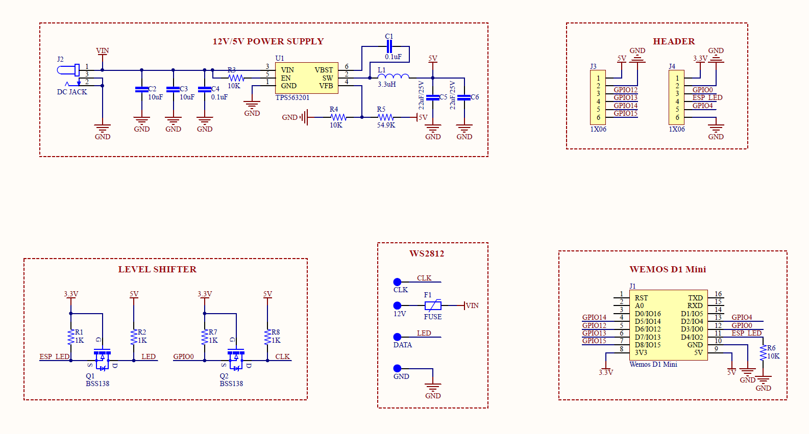
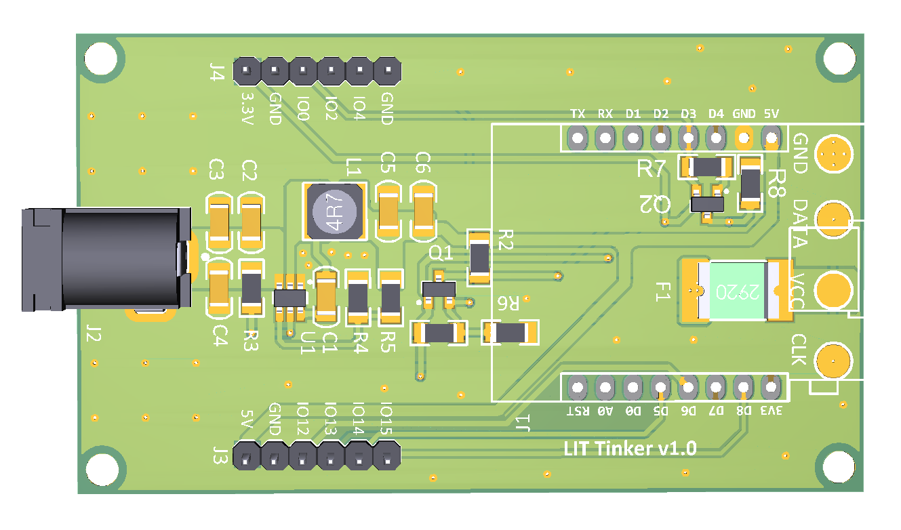

# LIT Tinker

LIT Tinker is a wireless controller designed for individually addressable LED strips such as the WS2811 and the WS2812/WS2812B. The controller is based on the Wemos D1 Mini (a ESP8266 breakout board).

The board features the following:

- Voltage regulator for both 5V and 12V power input. 
- 5V level shifter for LED's data/clock pin.
- Resettable fuse for overcurrent protection.
- Exposes GPIO 0, 2, 4, 12, 13, 14, 15, 3.3V and 5V power for other projects.

LIT Tinker works with many different ESP8266-compatible firmwares but [WLED](https://github.com/Aircoookie/WLED) is recommended.

The entire PCB design is open-source and you can find all relevant design files in the `PCB` folder.

You can find more information about the board or purchase a pre-assembled one here: www.litcontroller.com

## Schematics

## Board Layout

